# Type 0: Retain Original
This technique has not been given a type number in the past, but it’s been around 
since the beginning of SCDs. With type 0, the dimension attribute value never 
changes, so facts are always grouped by this original value. Type 0 is appropriate 
for any attribute labeled “original,” such as customer original credit score. It also 
applies to most attributes in a date dimension

# Type 1: Overwrite
With the slowly changing dimension type 1 response, you overwrite the old attribute value in the dimension row, replacing it with the current value; the attribute 
always reflects the most recent assignment.  
In this case, no dimension or fact table keys were modified.The type 1 response is the simplest approach for dimension attribute changes. In 
the dimension table, you merely overwrite the preexisting value with the current assignment. The fact table is untouched. The problem with a type 1 response is that 
you lose all history of attribute changes. Because overwriting obliterates historical attribute values, you’re left solely with the attribute values as they exist today. A type 
1 response is appropriate if the attribute change is an insignificant correction.It also may be appropriate if there is no value in keeping the old description.  
Finally, if a dimensional model is deployed via an OLAP cube and the type 1 attribute is a hierarchical rollup attribute, like the product’s department in our 
example, the cube likely needs to be reprocessed when the type 1 attribute changes. At a minimum, similar to the relational environment, the cube’s performance aggregations need to be recalculated.  

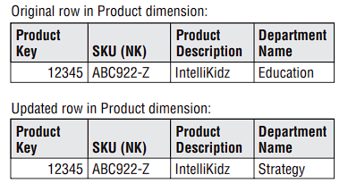

# Type 2: Add New Row
Slowly changing dimension type 2 changes add a new row in the dimension with the updated attribute values.  
This requires generalizing the primary key of the dimension beyond the natural or durable key because there will potentially be multiple rows describing each member.  
When a new row is created for a dimension member, a new primary surrogate key is assigned and used as a foreign key in all fact tables from the moment of the update until a subsequent change creates a new dimension key and updated dimension row.  
A minimum of three additional columns should be added to the dimension row with type 2 changes:   
1. Row effective date or date/time stamp
2. Row expiration date or date/time stamp
3. Current row indicator. 
With type 2 changes, the fact table is again untouched.  

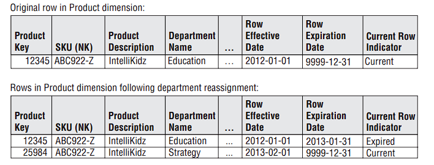

# Type 3: Add New Attribute
Slowly changing dimension type 3 changes add a new attribute in the dimension to preserve the old attribute value,  
the new value overwrites the main attribute as in a type 1 change. This kind of type 3 change is sometimes called an alternate reality.  
A business user can group and filter fact data by either the current value or alternate reality.
This slowly changing dimension technique is used relatively infrequently.

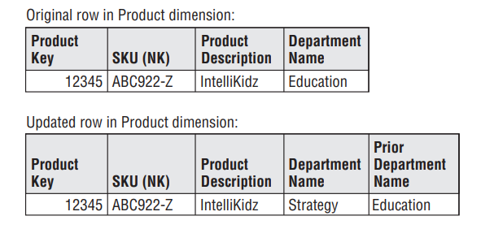

# Type 4: Add Mini-Dimension
Slowly changing dimension type 4 is used when a group of attributes in a dimension rapidly changes and is split off to a mini–dimension.  
This situation is sometimes called a rapidly changing monster dimension. Frequently used attributes in multimillion-row dimension tables are mini-dimension design candidates,  
even if they don’t frequently change. The type 4 mini-dimension requires its own unique primary key; the primary keys of both the base dimension and mini-dimension are captured in the associated fact tables

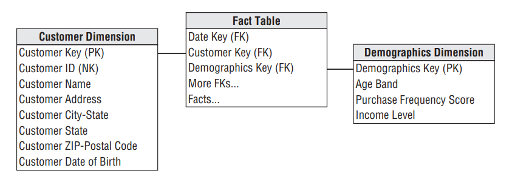

# Type 5: Add Mini-Dimension and Type 1 Outrigger
Slowly changing dimension type 5 is used to accurately preserve historical attribute values, plus report historical facts according to current attribute values.  
Type 5 builds on the type 4 mini-dimension by also embedding a current type 1 reference to the mini-dimension in the base dimension.  
This enables the currently-assigned mini-dimension attributes to be accessed along with the others in the base dimension without linking through a fact table. Logically, you’d represent the base dimension and mini-dimension outrigger as a single table in the presentation area.  
The ETL team must overwrite this type 1 mini-dimension reference whenever the current mini-dimension assignment changes.

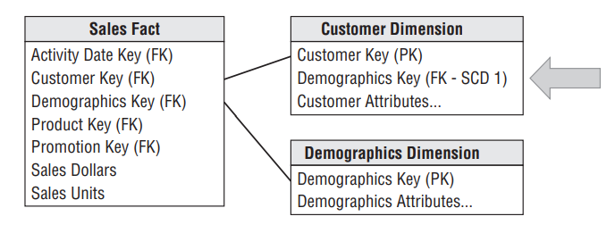

# Type 6: Add Type 1 Attributes to Type 2 Dimension
Like type 5, slowly changing dimension type 6 also delivers both historical and current dimension attribute values.  
Type 6 builds on the type 2 technique by also embedding current type 1 versions of the same attributes in the dimension row so that fact rows can be filtered or grouped by either the type 2 attribute value in effect when the measurement occurred or the attribute’s current value.  
In this case, the type 1 attribute is systematically overwritten on all rows associated with a particular durable key whenever the attribute is updated.

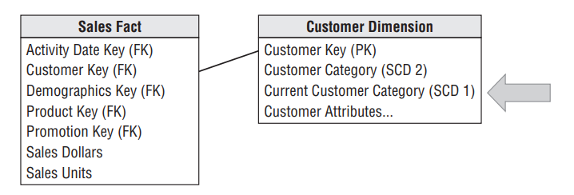  
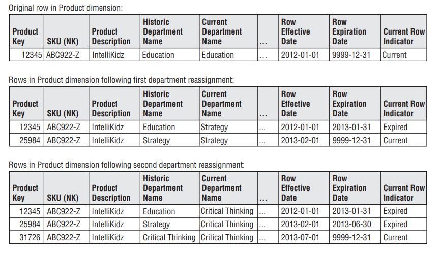

# Type 7: Dual Type 1 and Type 2 Dimensions
Slowly changing dimension type 7 is the final hybrid technique used to support both as-was and as-is reporting.  
A fact table can be accessed through  a dimension modeled both as a type 1 dimension showing only the most current attribute values, or as a type 2 dimension showing correct contemporary  historical profiles.  
The same dimension table enables both perspectives. Both the durable key and primary surrogate key of the dimension are placed in the fact table. For the type 1 perspective, the current flag in the dimension is constrained to be current,  and the fact table is joined via the durable key.  
For the type 2 perspective, the current flag is not constrained, and the fact table is joined via the surrogate primary key.  
These two perspectives would be deployed as separate views to the BI applications.

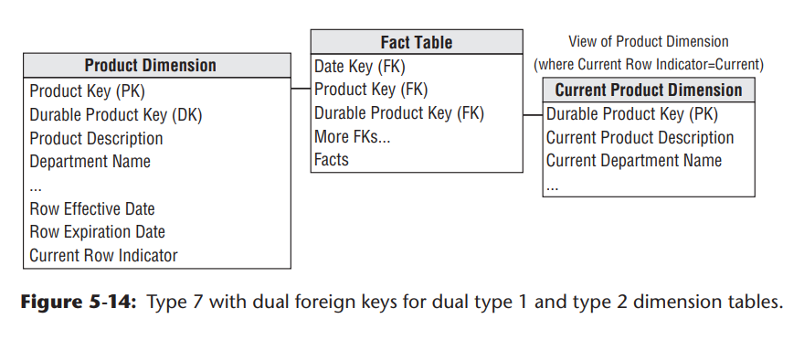  
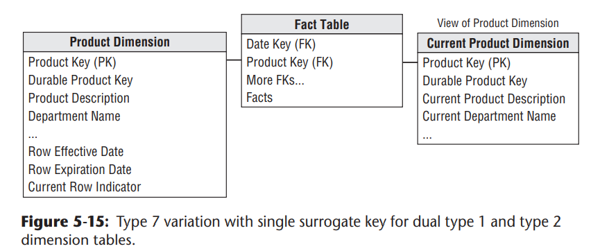  
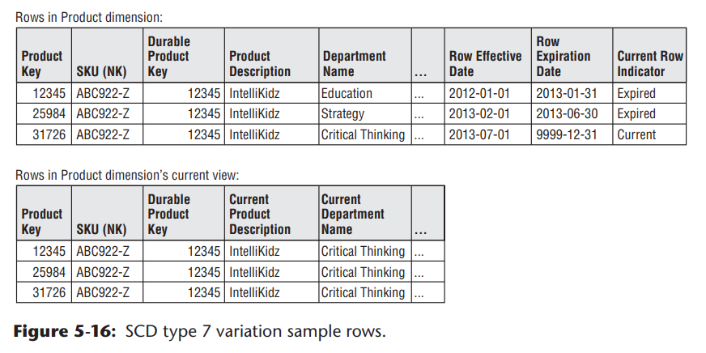

# Comparison

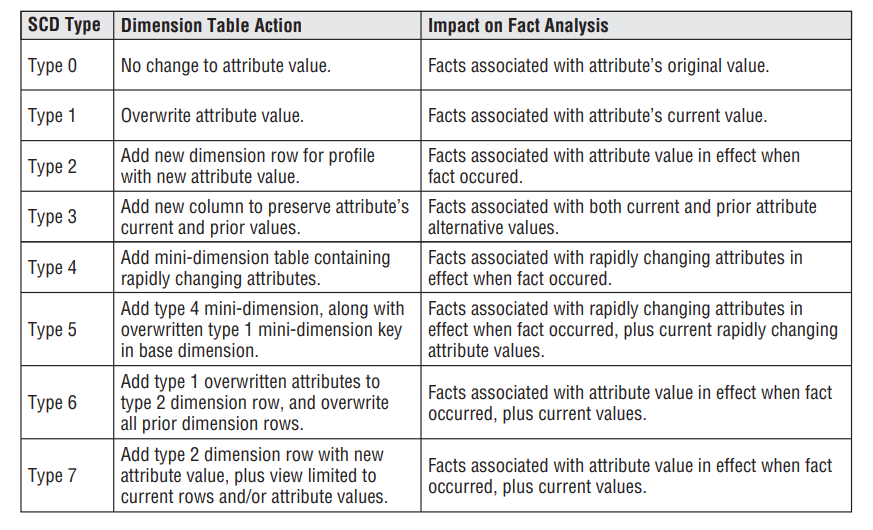