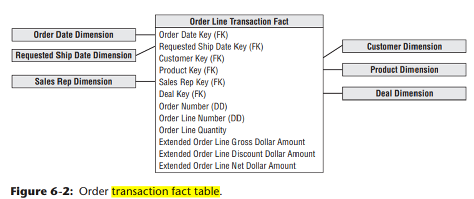
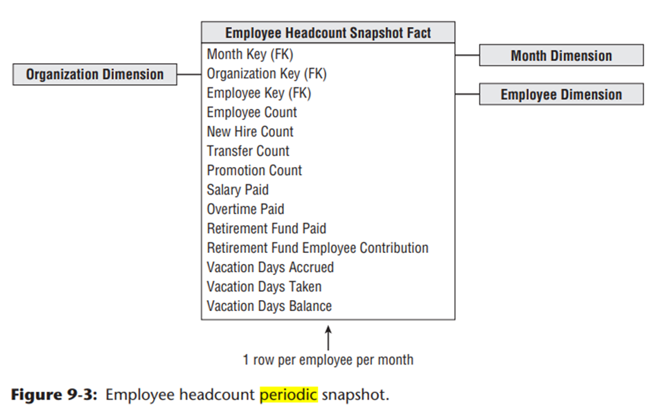
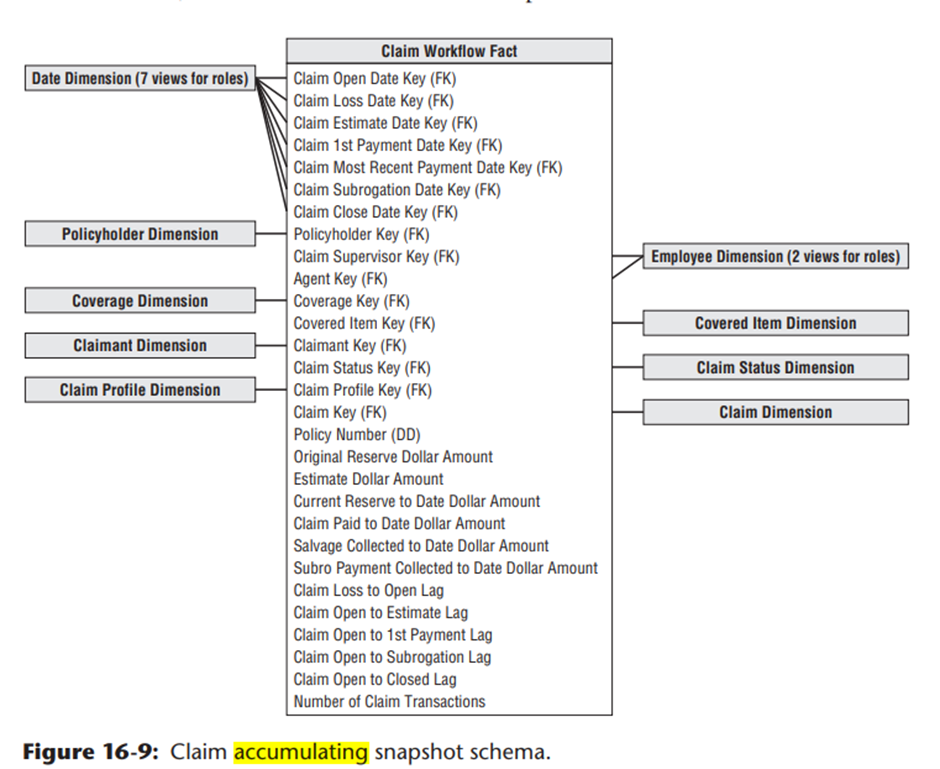
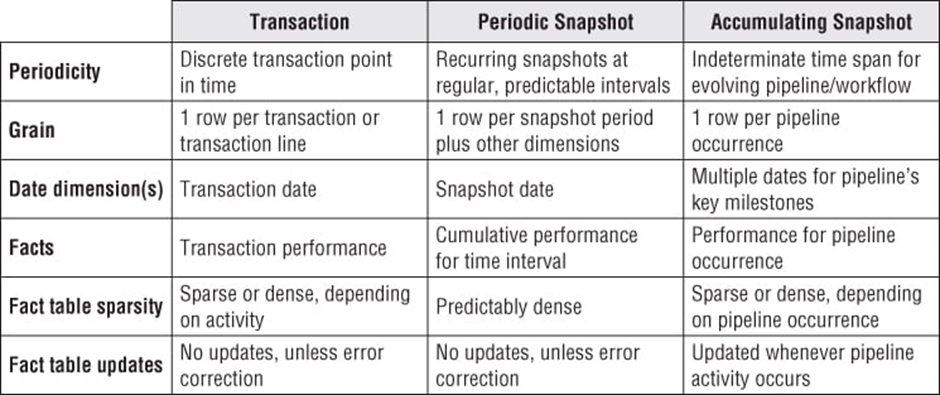
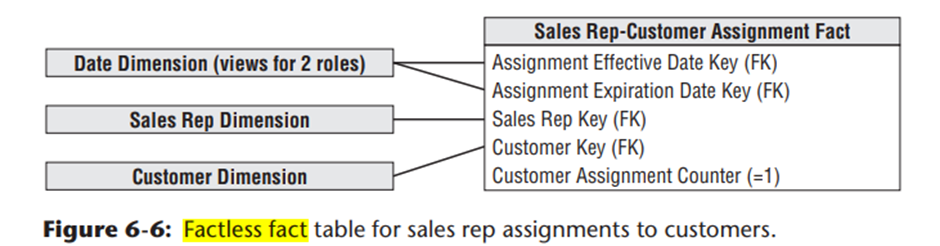
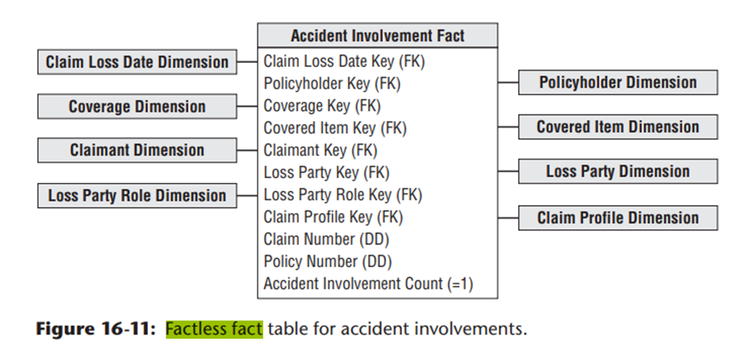

## Transaction Fact Tables
A row in a transaction fact table corresponds to a measurement event at a point in space and time. Atomic transaction  
grain fact tables are the most dimensional and expressive fact tables, this robust dimensionality enables the maximum  
slicing and dicing of transaction data. Transaction fact tables may be dense or sparse because rows exist only if  
measurements take place. These fact tables always contain a foreign key for each associated dimension, and optionally  
contain precise time stamps and degenerate dimension keys. The measured numeric facts must be consistent with  
the transaction grain.
- Contains data of discrete business event
- Contains atomic level data the lowest granularity
- Generally a huge number of rows in table

## Periodic Snapshot Fact Tables
A row in a periodic snapshot fact table summarizes many measurement events occurring over a standard period,  
such as a day, a week, or a month. The grain is the period, not the individual transaction. Periodic snapshot  
fact tables often contain many facts because any measurement event consistent with the fact table grain is permissible.  
These fact tables are uniformly dense in their foreign keys because even if no activity takes place during the period,  
a row is typically inserted in the fact table containing a zero or null for each fact.

## Accumulating Snapshot Fact Tables
A row in an accumulating snapshot fact table summarizes the measurement events occurring at predictable steps between  
the beginning and the end of a process. Pipeline or workflow processes, such as order fulfillment or claim processing,  
that have a defined start point, standard intermediate steps, and defined end point can be modeled with this type of  
fact table. There is a date foreign key in the fact table for each critical milestone in the process. An individual  
row in an accumulating snapshot fact table, corresponding for instance to a line on an order, is initially  
inserted when the order line is created. As pipeline progress occurs, the accumulating fact table row is revisited  
and updated. This consistent updating of accumulating snapshot fact rows is unique among the three types of fact tables.  
In addition to the date foreign keys associated with each critical process step, accumulating snapshot fact tables  
contain foreign keys for other dimensions and optionally contain degenerate dimensions. They often include numeric  
lag measurements consistent with the grain, along with milestone completion counters.

## Comparison

## Fact-less Fact Tables
Although most measurement events capture numerical results, it is possible that the event merely records a set of  
dimensional entities coming together at a moment in time. For example, an event of a student attending a class on  
a given day may not have a recorded numeric fact, but a fact row with foreign keys for calendar day, student,  
teacher, location, and class is well-defi ned. Likewise, customer communications are events, but there may be no  
associated metrics. Fact-less fact tables can also be used to analyze what did not happen. These queries always have  
two parts A fact-less coverage table that contains all the possibilities of events that might happen and an activity  
table that contains the events that did happen. When the activity is subtracted from the coverage,  
the result is the set of events that did not happen
  
  
  

## Aggregate Fact Tables or OLAP Cubes
Aggregate fact tables are simple numeric rollup of atomic fact table data built solely to accelerate query performance.  
These aggregate fact tables should be available to the BI layer at the same time as the atomic fact tables so that BI  
tools smoothly choose the appropriate aggregate level at query time.

## Consolidated Fact Tables
It is often convenient to combine facts from multiple processes together into a single consolidated fact table if they  
can be expressed at the same grain. For example, sales actuals can be consolidated with sales forecasts in a single  
fact table to make the task of analyzing actuals versus forecasts simple and fast, as compared to assembling a  
drill-across application using separate fact tables. Consolidated fact tables add burden to the ETL processing,  
but ease the analytic burden on the BI applications. They should be considered for cross-process metrics that are  
frequently analyzed together.
