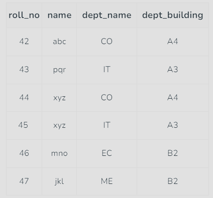
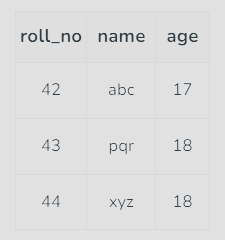
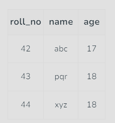
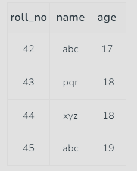
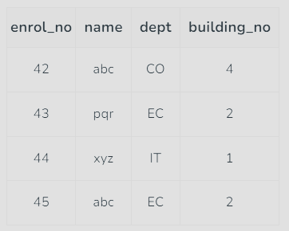

# What is functional dependencies ?
In a relational database management, functional dependency is a concept that specifies the relationship between two sets of attributes where one attribute determines the value of  
another attribute. It is denoted as X → Y, where the attribute set on the left side of the arrow, X is called Determinant, and Y is called the Dependent.  

From the above table we can conclude some valid functional dependencies:  
- roll_no → { name, dept_name, dept_building },→  Here, roll_no can determine values of fields name, dept_name and dept_building, hence a valid Functional dependency
- roll_no → dept_name , Since, roll_no can determine whole set of {name, dept_name, dept_building}, it can determine its subset dept_name also.
- dept_name → dept_building ,  Dept_name can identify the dept_building accurately, since departments with different dept_name will also have a different dept_building
- roll_no → name, {roll_no, name} ⇢ {dept_name, dept_building}, etc.

Here are some invalid functional dependencies:
- name → dept_name Students with the same name can have different dept_name, hence this is not a valid functional dependency.
- dept_building → dept_name There can be multiple departments in the same building. Example, in the above table departments ME and EC are in the same building B2, hence dept_building → dept_name is an invalid functional dependency.
- name → roll_no, {name, dept_name} → roll_no, dept_building → roll_no, etc.

Armstrong’s axioms/properties of functional dependencies:
- __Reflexivity:__ If Y is a subset of X, then X→Y holds by reflexivity rule  
Example, {roll_no, name} → name is valid.
- __Augmentation:__ If X → Y is a valid dependency, then XZ → YZ is also valid by the augmentation rule.  
Example, {roll_no, name} → dept_building is valid, hence {roll_no, name, dept_name} → {dept_building, dept_name} is also valid.
- __Transitivity:__ If X → Y and Y → Z are both valid dependencies, then X→Z is also valid by the Transitivity rule.  
Example, roll_no → dept_name & dept_name → dept_building, then roll_no → dept_building is also valid.

# Types of Functional Dependencies in DBMS
__1. Trivial functional dependency :__  In Trivial Functional Dependency, a dependent is always a subset of the determinant. i.e. If X → Y and Y is the subset of X,
then it is called trivial functional dependency.Here, {roll_no, name} → name is a trivial functional dependency,
since the dependent name is a subset of determinant set {roll_no, name}. Similarly, roll_no → roll_no is also an example of trivial functional dependency.  

__2. Non-Trivial functional dependency :__ In Non-trivial functional dependency, the dependent is strictly not a subset of the determinant. i.e.
If X → Y and Y is not a subset of X, then it is called Non-trivial functional dependency.
Here, roll_no → name is a non-trivial functional dependency, since the dependent name is not a subset of determinant roll_no.
Similarly, {roll_no, name} → age is also a non-trivial functional dependency, since age is not a subset of {roll_no, name}.  

__3. Multivalued functional dependency :__ In Multivalued functional dependency, entities of the dependent set are not dependent on each other. i.e.  
If a → {b, c} and there exists no functional dependency between b and c, then it is called a multivalued functional dependency.
Here, roll_no → {name, age} is a multivalued functional dependency, since the dependents name & age are not dependent on  
each other(i.e. name → age or age → name doesn’t exist !)  

__4. Transitive functional dependency :__ In transitive functional dependency, dependent is indirectly dependent on determinant. i.e.  
If a → b & b → c, then according to axiom of transitivity, a → c. This is a transitive functional dependency.
Here, enrol_no → dept and dept → building_no. Hence, according to the axiom of transitivity, enrol_no → building_no is a valid functional dependency.  
This is an indirect functional dependency, hence called Transitive functional dependency.  

__5. Fully Functional Dependency :__
In full functional dependency an attribute or a set of attributes uniquely determines another attribute or set of attributes.  
If a relation R has attributes X, Y, Z with the dependencies X->Y and X->Z which states that those dependencies are fully functional.

__6. Partial Functional Dependency :__
In partial functional dependency a non key attribute depends on a part of the composite key, rather than the whole key.  
If a relation R has attributes X, Y, Z where X and Y are the composite key and Z is non key attribute. Then X->Z is a partial functional dependency in RBDMS.