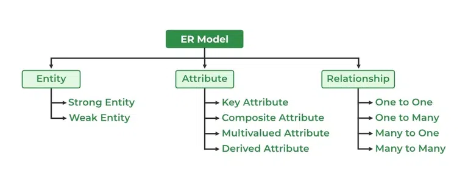
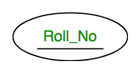
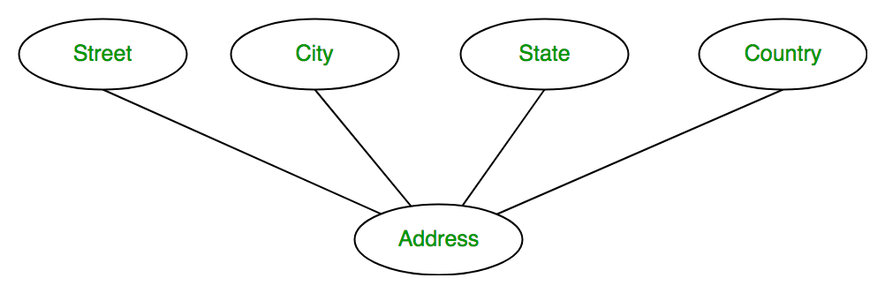
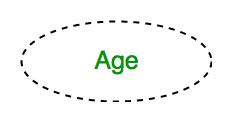
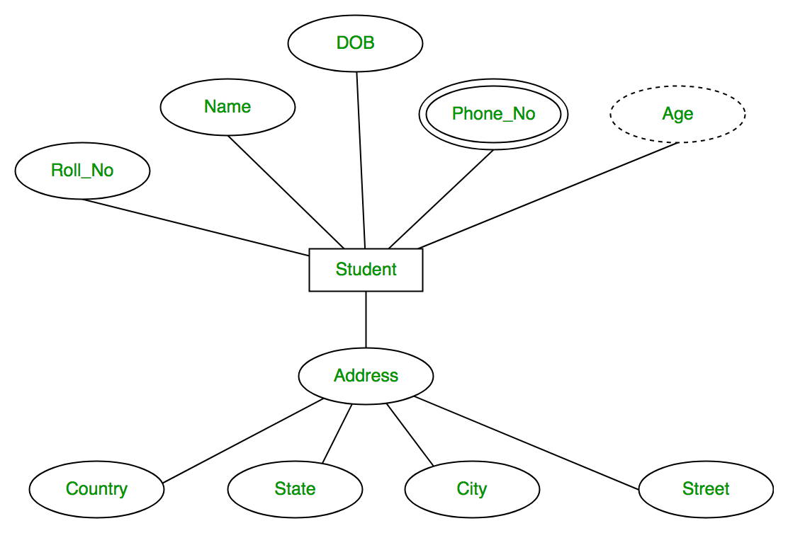
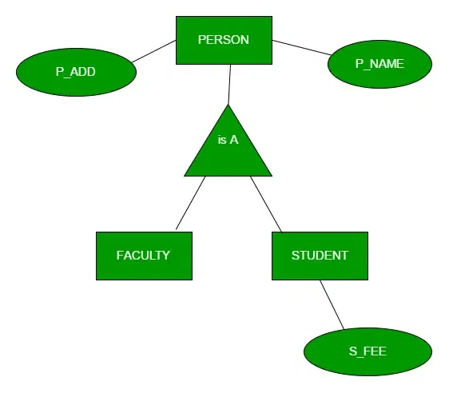
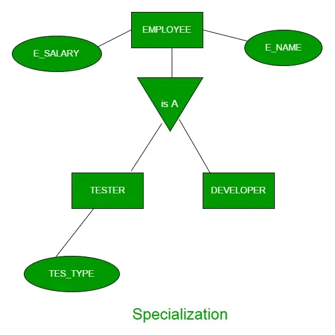
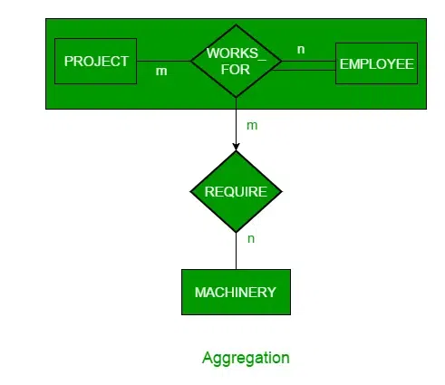
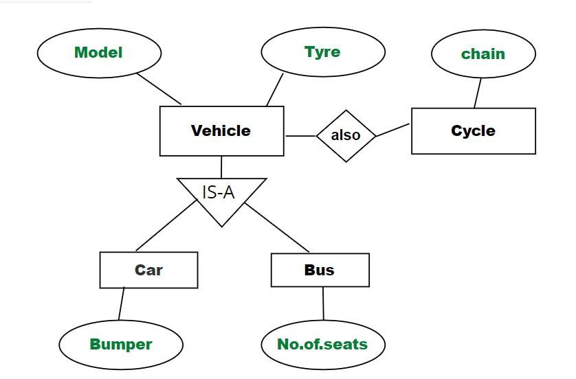

# What is an ER Model?
An Entity-Relationship Model represents the structure of the database with the help of a diagram. ER Modelling is a systematic process to design a database.

# What is an ER Diagram?
An Entity Relationship Diagram (ER Diagram) pictorially explains the relationship between entities to be stored in a database.
Fundamentally, the ER Diagram is a structural design of the database.
It acts as a framework created with specialized symbols for the purpose of defining the relationship between the database entities.
ER diagram is created based on three principal components: entities, attributes, and relationships

# Symbols Used in ER Model
ER Model is used to model the logical view of the system from a data perspective which consists of these symbols:
- __Rectangles__: Rectangles represent Entities in the ER Model.
- __Ellipses__: Ellipses represent Attributes in the ER Model.
- __Diamond__: Diamonds represent Relationships among Entities.
- __Lines__: Lines represent attributes to entities and entity sets with other relationship types.
- __Double Ellipse__: Double Ellipses represent Multi-Valued Attributes.
- __Double Rectangle__: Double Rectangle represents a Weak Entity.

# Components of ER Diagram
ER Model consists of Entities, Attributes, and Relationships among Entities in a Database System.

## Entity
An Entity may be an object with a physical existence like a particular person, car, house, or employee
or it may be an object with a conceptual existence – a company, a job, or a university course. 

## Entity Set 
An Entity is an object of Entity Type and a set of all entities is called an entity set.
For Example, E1 is an entity having Entity Type Student and the set of all students is called Entity Set.

## Attributes
Attributes are the properties that define the entity type. For example, Roll_No, Name, DOB, Age, Address, and Mobile_No are the attributes that define entity type Student.

# Type of Entities

## Strong Entity
A Strong Entity is a type of entity that has a key Attribute. Strong Entity does not depend on other Entity in the Schema.
It has a primary key, that helps in identifying it uniquely, and it is represented by a rectangle. These are called Strong Entity Types.

## Weak Entity
An Entity type has a key attribute that uniquely identifies each entity in the entity set.
But some entity type exists for which key attributes can’t be defined. These are called Weak Entity types.
- __Example__ : A company may store the information of dependents (Parents, Children, Spouse) of an Employee.
But the dependents don’t have existed without the employee.So Dependent will be a Weak Entity Type and 
Employee will be Identifying Entity type for Dependent, which means it is Strong Entity Type.

A weak entity type is represented by a Double Rectangle.The participation of weak entity types is always total.
The relationship between the weak entity type and its identifying strong entity type is called identifying relationship 

# Type of Attributes

- ## Key Attribute
The attribute which uniquely identifies each entity in the entity set is called the key attribute.  
For example, Roll_No will be unique for each student.In ER diagram, the key attribute is represented by an oval with underlying lines.

- ## Simple Attribute
An attribute which cant be divided further like Age.

- ## Composite Attribute
An attribute composed of many other attributes is called a composite attribute.  
For example, the Address attribute of the student Entity type consists of Street, City, State, and Country.
In ER diagram, the composite attribute is represented by an oval comprising of ovals.

- ## Singlevalued Attribute
An attribute having single value for an entity.  
For example, Age

- ## Multivalued Attribute
An attribute consisting of more than one value for a given entity.  
For example, Phone_No (can be more than one for a given student).
In ER diagram, a multivalued attribute is represented by a double oval.

- ## Stored Attribute
An attribute from which value of other attributes are derived   
For example, DOB

- ## Derived Attribute
An attribute that can be derived from other attributes of the entity type is known as a derived attribute. e.g.; Age (can be derived from DOB).
In ER diagram, the derived attribute is represented by a dashed oval.

- ## Complex Attribute
An attribute which have composite attributes as well as multivalue attributes.
Multivalue attributes represented within {}  
Composite attributes represented within ()  
For Example : CollegeDegrees{(College,Degree,Year,Field)}

#### Complete Example

# Degrees of Relationship

- ## Unary relationship
In a unary relationship, only one entity is involved. There is only a single entity set, i.e., the association is between a single entity. Here, the degree of relationship is 1. The unary relationship is also known as a recursive relationship.

- ## Binary relationship
There are two entities involved. There are two entities that are participating in the relationship. The degree of relationship is 2. This is the most common type of relationship.

- ## Ternary relationship
There are three entities involved. There are three entities that are participating in the relationship created. The degree of the relationship is 3. As in this relationship, the number of entities increases, it is a bit difficult to convert it to a relational table

- ## N-ary relationship
This is a generalized form of a relationship when the n number of total entities are participating. When there is an n number of involved entities, we can say that they have an N-ary relationship. As there are many entities involved, it is hard to convert them to a relational table. It is an uncommon relationship that is not as widely used as a binary relationship. The degree of relationship is 'n'.

# Generalization, Specialization and Aggregation in ER Model

Using the ER model for bigger data creates a lot of complexity while designing a database model, So in order to minimize the complexity Generalization, Specialization, and Aggregation were introduced in the ER model and these were used for data abstraction in which an abstraction mechanism is used to hide details of a set of objects.  
Some of the terms were added to the Enhanced ER Model, where some new concepts were added. These new concepts are:  
1. Generalization
2. Specialization
3. Aggregation

## Generalization
Generalization is the process of extracting common properties from a set of entities and creating a generalized entity from it.  
It is a bottom-up approach in which two or more entities can be generalized to a higher-level entity if they have some attributes in common  

## Specialization
In specialization, an entity is divided into sub-entities based on its characteristics.  
It is a top-down approach where the higher-level entity is specialized into two or more lower-level entities.  

## Aggregation
An ER diagram is not capable of representing the relationship between an entity and a relationship which may be required in some scenarios.  
In those cases, a relationship with its corresponding entities is aggregated into a higher-level entity.  
Aggregation is an abstraction through which we can represent relationships as higher-level entity sets.

For Example, an Employee working on a project may require some machinery. So, REQUIRE relationship is needed between the relationship WORKS_FOR and entity MACHINERY. Using aggregation, WORKS_FOR relationship with its entities EMPLOYEE and PROJECT is aggregated into a single entity and relationship REQUIRE is created between the aggregated entity and MACHINERY.

## Inheritance: 
It is an important feature of generalization and specialization

### Attribute inheritance: 
Allows lower level entities to inherit the attributes of higher level entities and vice versa. In diagram: Car entity is an inheritance of Vehicle entity ,So Car can acquire attributes of Vehicle 
Example:car can acquire Model attribute of Vehicle.

### Participation Inheritance: 
In participation inheritance, relationships involving higher level entity set also inherited by lower level entity and vice versa.
In diagram: Vehicle entity has a relationship with Cycle entity ,So Cycle entity can acquire attributes of lower level entities i.e Car and Bus since it is inheritance of Vehicle.

