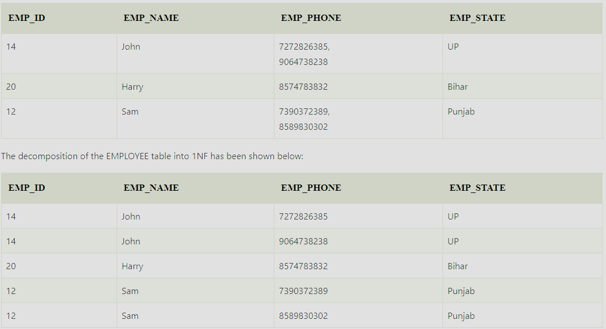
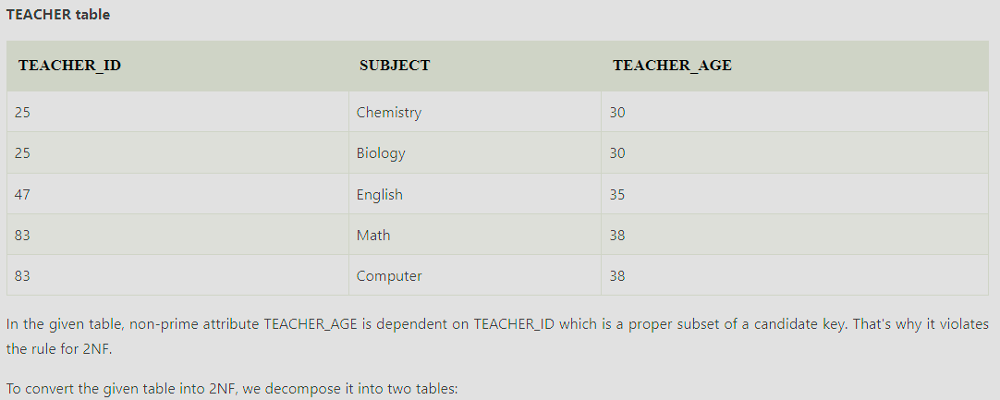
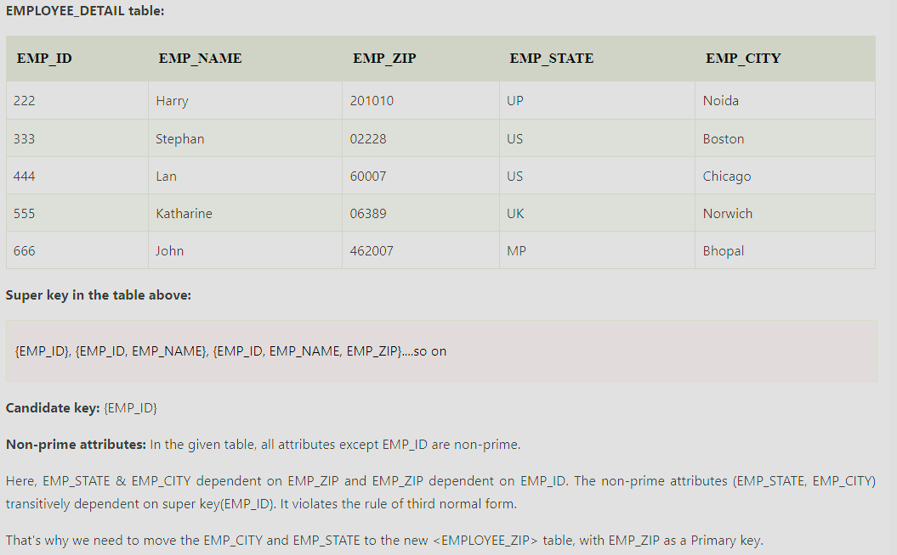
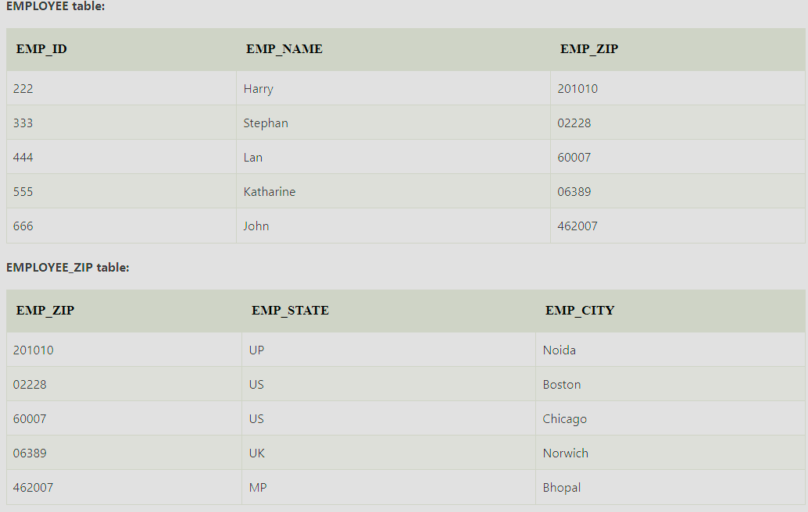
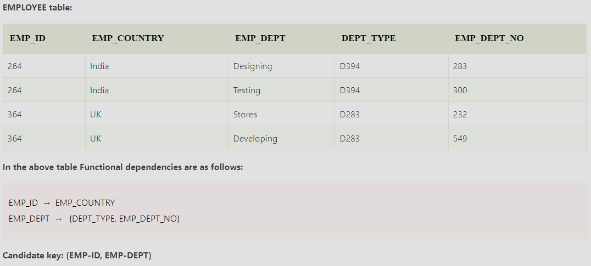
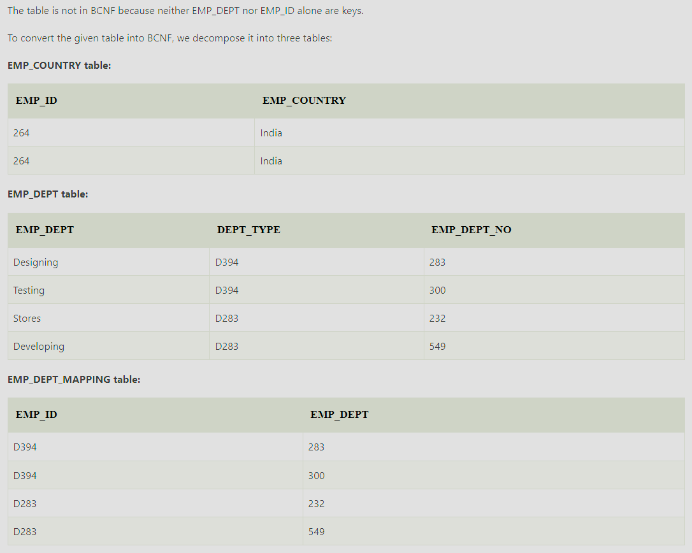

# What is Normalization?
- Normalization is the process of organizing the data in the database. 
- Normalization is used to minimize the redundancy from a relation or set of relations.It is also used to eliminate undesirable characteristics like Insertion, Update, and Deletion Anomalies.
- Normalization divides the larger table into smaller and links them using relationships.
- The normal form is used to reduce redundancy from the database table.

# Why do we need Normalization?
The main reason for normalizing the relations is removing these anomalies. Failure to eliminate anomalies leads to data redundancy and can cause data integrity and other problems as the database grows.  
Normalization consists of a series of guidelines that helps to guide you in creating a good database structure.  
Data modification anomalies can be categorized into three types:  
__Insertion Anomaly:__ Insertion Anomaly refers to when one cannot insert a new tuple into a relationship due to lack of data.  
__Deletion Anomaly:__ The delete anomaly refers to the situation where the deletion of data results in the unintended loss of some other important data.  
__Updation Anomaly:__ The update anomaly is when an update of a single data value requires multiple rows of data to be updated.  
# Type of Normalization  
## First Normal Form (1NF)
For a table to be in the First Normal Form, it should follow the following 4 rules:
- It should only have single(atomic) valued attributes/columns.
- Values stored in a column should be of the same domain.
- All the columns in a table should have unique names.
- The order in which data is stored should not matter.

## Second Normal Form (2NF)
For a table to be in the Second Normal Form,
- It should be in the First Normal form.
- It should not have Partial Dependency.
  When a table has a primary key  made up of two or more columns, then all the columns (not included in the primary key) in that 
  table should depend on the entire primary key and not on a part of it. If any column (which is not in the primary key) depends on a part 
  of the primary key, then we say we have Partial dependency in the table.
   
 

## Third Normal Form (3NF)
A table is said to be in the Third Normal Form when
- It satisfies the First Normal Form and the Second Normal form.
- It doesn't have Transitive Dependency. In a table we have some column that acts as the primary key and other columns depends on this 
  column. But what if a column that is not the primary key depends on another column that is also not a primary key or part of it? Then 
  we have Transitive dependency in our table.
  
  

## Boyce-Codd Normal Form (BCNF)
Boyce and Codd Normal Form is a higher version of the Third Normal Form.  
This form deals with a certain type of anomaly that is not handled by 3NF.
A 3NF table that does not have multiple overlapping candidate keys is said to be in BCNF.  
For a table to be in BCNF, the following conditions must be satisfied:
- R must be in the third Normal Form
- For each functional dependency (X → Y), X should be a Super Key.
 
 

## Fourth Normal Form (4NF)
A table is said to be in the Fourth Normal Form when,
- It is in the Boyce-Codd Normal Form.
- It doesn't have Multi-Valued Dependency.

## Fifth Normal Form (5NF)
The fifth normal form is also called the PJNF - Project-Join Normal Form  
It is the most advanced level of Database Normalization.  
Using Fifth Normal Form, you can fix Join dependency and reduce data redundancy.  
It also helps in fixing Update anomalies in DBMS design.
